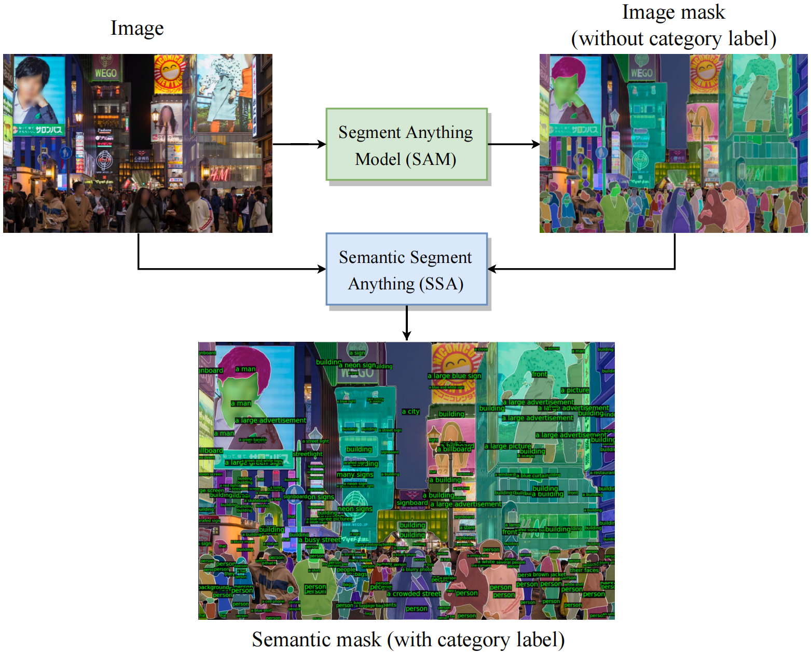
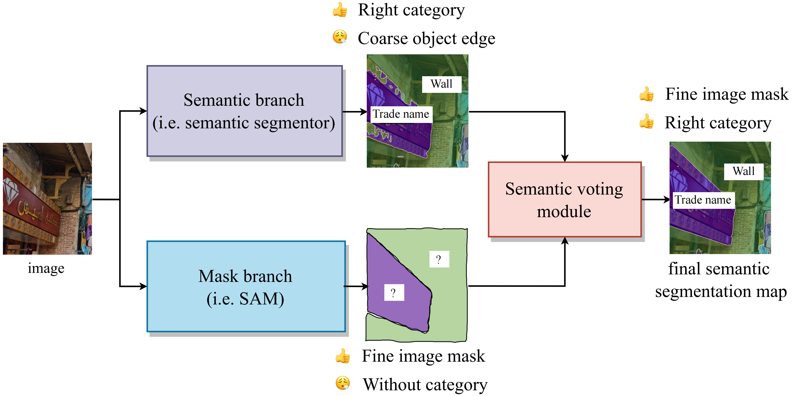

<p align="center">
  
</p>

### [Official repo](https://github.com/fudan-zvg/Semantic-Segment-Anything)
> **[Semantic Segment Anything](https://github.com/fudan-zvg/Semantic-Segment-Anything)**  
> Jiaqi Chen, Zeyu Yang, and Li Zhang  
> Zhang Vision Group, Fudan Univerisity

SAM is a powerful model for arbitrary object segmentation, while SA-1B is the largest segmentation dataset to date. However, SAM lacks the ability to predict semantic categories for each mask. 
(I) To address above limitation, we propose a pipeline on top of SAM to predict semantic category for each mask, called **_Semantic Segment Anything (SSA)_**.
(II) Moreover, our SSA can serve as an automated dense open-vocabulary annotation engine called **_Semantic segment anything labeling engine (SSA-engine)_**, providing rich semantic category annotations for SA-1B or any other dataset. This engine significantly reduces the need for manual annotation and associated costs.

### 🤔 Why do we need SSA?
- SAM is a highly generalizable object segmentation algorithm that can provide precise masks. SA-1B is the largest image segmentation dataset to date, providing fine mask segmentation annotations. Neither SAM nor SA-1B provide category predictions or annotations for each mask. This makes it difficult for researchers to use the powerful SAM algorithm to directly solve semantic segmentation tasks or to utilize SA-1B to train their own models.
- Advanced close-set segmenters like Oneformer, open-set segmenters like CLIPSeg, and image caption methods like BLIP can provide rich semantic annotations. However, their mask segmentation predictions may not be as comprehensive and accurate as those generated by SAM, which has highly precise and detailed boundaries.
- Therefore, by combining the fine image segmentation masks from SAM and SA-1B with the rich semantic annotations provided by these advanced models, we can generate semantic segmentation models with stronger generalization ability, as well as a large-scale densely categorized image segmentation dataset.
### 👍 What SSA can do?
- **SSA:** This is the first open framework that utilizes SAM for semantic segmentation task. It supports users to seamlessly integrate their existing semantic segmenters with SAM without the need for retraining or fine-tuning SAM's weights, enabling them to achieve better generalization and more precise mask boundaries.  
- **SSA-engine:** SSA-engine provides dense open-vocabulary category annotations for large-scale SA-1B dataset. After manual review and refinement, these annotations can be used to train segmentation models or fine-grained CLIP models.
### ✈️ SSA: Semantic segment anything

SSA is a semantic segmentation model based on SAM, and it is an open framework that allows users to integrate any advanced semantic segmentation models. The predicted mask boundaries by the segmentor do not need to be highly accurate, as the focus is on providing category predictions.
Therefore, if you have trained an older model on your dataset, you do not need to discard it and retrain a new SAM-based model. Instead, you can continue to use the older model as the Semantic Branch. SAM's powerful generalization and image segmentation ability can provide a boost to the older model.

In addition, SSA is an out-of-the-box architecture that does not require additional fine-tuning of SAM's weights. It can perform inference directly and complete semantic segmentation tasks with ease.

SSA consists of two branches, Mask Branch and Semantic Branch, as well as a voting module that determines the category for each mask.
- **(I) Mask branch (blue).** SAM serves as the Mask branch and provides a set of masks with clear boundaries. 

- **(II) Semantic branch (purple).** This branch provides the category for each pixel, which is implemented by a semantic segmentor that users can customize in terms of the segmentor's architecture and the interested categories. The segmentor does not need to have highly detailed boundaries, but it should classify each region as accurately as possible.

- **(III) Semantic Voting module (red).** This module crops out the corresponding pixel categories based on the mask's position. The top-1 category among these pixel categories is considered as the classification result for that mask.
### 🚄 SSA-engine: Semantic segment anything labeling engine

SSA-engine is an automated annotation engine that serves as the initial semantic labeling for the SA-1B dataset. While human review and refinement may be required for more accurate labeling.
Thanks to the combined architecture of close-set segmentation and open-vocabulary segmentation, SSA-engine produces satisfactory labeling for most samples and has the capability to provide more detailed annotations using image caption method.

This tool fills the gap in SA-1B's limited fine-grained semantic labeling, while also significantly reducing the need for manual annotation and associated costs. 
It has the potential to serve as a foundation for training large-scale visual perception models and more fine-grained CLIP models.

The SSA-engine consists of three components:
- **(I) Close-set semantic segmentor (green).** Two close-set semantic segmentation models trained on COCO and ADE20K datasets respectively are used to segment the image and obtain rough category information. The predicted categories only include simple and basic categories to ensure that each mask receives a relevant label.
- **(II) Open-vocabulary classifier (blue).** An image captioning model is utilized to describe the cropped image patch corresponding to each mask. Nouns or phrases are then extracted as candidate open-vocabulary categories. This process provides more diverse category labels.
- **(III) Final decision module (orange).** The SSA-engine uses a Class proposal filter (_i.e._ a CLIP) to filter out the top-_k_ most reasonable predictions from the mixed class list. Finally, the Open-vocabulary Segmentor predicts the most suitable category within the mask region based on the top-_k_ classes and image patch.

### 📖 News
🔥 2023/4/14: SSA benchmarks semantic segmentation on ADE20K and Cityscapes.  
🔥 2023/04/10: Semantic Segment Anything (SSA and SSA-engine) is released.  
🔥 2023/04/05: SAM and SA-1B are released.  
## Results
### 1. Inference time
| Dataset | mode                        | Inference time per image (s) | Inference time per mask (s) |
|:--------|:----------------------------|:-----------------------------|:----------------------------|
| SA-1B   | Open-vocabulary             | 33.333                       | 0.334                       |
| SA-1B   | Close set | 1.149                        | 0.012                       |

This performance was tested on a single NVIDIA A6000 GPU.
### 2. Close-set semantic segmentation on ADE20K and Cityscapes dataset
| Dataset    | Model | mIoU  |
|:-----------|:------|:------|
| ADE20K     | SSA   | 54.08 |
| Cityscapes | SSA   | 79.94 |

## Examples
### Open-vocabulary prediction on SA-1B


- Addition example for Open-vocabulary annotations


### Close-set semantic segmentation on ADE20K

<div style="display: flex; justify-content: center;">
  <div style="width: 50%;">
    
    <p style="text-align: center; margin-top: 0;">(a) Oneformer</p>
  </div>
  <div style="width: 50%;">
    
    <p style="text-align: center; margin-top: 0;">(b) SSA (Ours)</p>
  </div>
</div>

### Close-set semantic segmentation on Cityscapes
<div style="display: flex; justify-content: center;">
  <div style="width: 50%;">
    
    <p style="text-align: center; margin-top: 0;">(a) Oneformer</p>
  </div>
  <div style="width: 50%;">
    
    <p style="text-align: center; margin-top: 0;">(b) SSA (Ours)</p>
  </div>
</div>

### Close-set semantic segmentation on SA-1B
<div style="display: flex; justify-content: center;">
  <div style="width: 50%;">
    
    <p style="text-align: center; margin-top: 0;">(a) Oneformer</p>
  </div>
  <div style="width: 50%;">
    
    <p style="text-align: center; margin-top: 0;">(b) SSA (Ours)</p>
  </div>
</div>


## 💻 Requirements
- Python 3.7+
- CUDA 11.1+

## 🛠️ Installation
```bash
git clone git@github.com:fudan-zvg/Semantic-Segment-Anything.git
cd Semantic-Segment-Anything
conda env create -f environment.yaml
conda activate ssa
python -m spacy download en_core_web_sm
# install segment-anything
cd ..
git clone git@github.com:facebookresearch/segment-anything.git
cd segment-anything; pip install -e .; cd ../Semantic-Segment-Anything
```
## 🚀 Quick Start
### 1. SSA
#### 1.1 Preparation
Dowload the ADE20K or Cityscapes dataset, and unzip them to the `data` folder.

**Folder sturcture:**
```none
├── Semantic-Segment-Anything
├── data
│   ├── ade
│   │   ├── ADEChallengeData2016
│   │   │   ├── images
│   │   │   │   ├── training
│   │   │   │   ├── validation
│   │   │   │   │   ├── ADE_val_00002000.jpg
│   │   │   │   │   ├── ...
│   │   │   │   ├── test
│   │   │   ├── annotations
│   │   │   │   ├── training
│   │   │   │   ├── validation
│   │   │   │   │   ├── ADE_val_00002000.png
│   │   │   │   │   ├── ...
│   ├── cityscapes
│   │   ├── leftImg8bit
│   │   │   ├── train
│   │   │   ├── val
│   │   │   │   ├── frankfurt
│   │   │   │   ├── lindau
│   │   │   │   ├── munster
│   │   │   │   │   ├── munster_000173_000019_leftImg8bit.png
│   │   ├── gtFine
│   │   │   ├── train
│   │   │   ├── val
│   │   │   │   ├── frankfurt
│   │   │   │   ├── lindau
│   │   │   │   ├── munster
│   │   │   │   │   ├── munster_000173_000019_gtFine_labelTrainIds.png
│   │   ├── ...
```

Dowload the checkpoint of SAM and put it to the `ckp` folder.
```bash
mkdir ckp && cd ckp
wget https://dl.fbaipublicfiles.com/segment_anything/sam_vit_h_4b8939.pth
cd ..
```
#### 1.2 SSA inference
Run our SSA on ADE20K with 8 GPUs:
```bash
python scripts/main_ssa.py --ckpt_path ./ckp/sam_vit_h_4b8939.pth --save_img --world_size 8 --dataset ade20k --data_dir data/ade20k/ADEChallengeData2016/images/validation/ --gt_path data/ade20k/ADEChallengeData2016/annotations/validation/ --out_dir output_ade20k_test
```

Run our SSA on Cityscapes with 8 GPUs:
```bash
python scripts/main_ssa.py --ckpt_path ./ckp/sam_vit_h_4b8939.pth --save_img --world_size 8 --dataset cityscapes --data_dir data/cityscapes/leftImg8bit/val/ --gt_path data/cityscapes/gtFine/val/ --out_dir output_cityscapes
```

#### 1.3 SSA evaluation (after inference)
Get the evaluate result of ADE20K:
```bash
python evaluation.py --gt_path data/ade20k/ADEChallengeData2016/annotations/validation --result_path output_ade20k/ --dataset ade20k
```

Get the evaluate result of Cityscapes:
```bash
python evaluation.py --gt_path data/cityscapes/gtFine/val/ --result_path output_cityscapes/ --dataset cityscapes
```
### 2. SSA-engine
Download the [SA-1B](https://segment-anything.com/) dataset and unzip it to the `data/sa_1b` folder.  
Or you use your own dataset.
**Folder sturcture:**
```none
├── Semantic-Segment-Anything
├── data
│   ├── sa_1b
│   │   ├── sa_223775.jpg
│   │   ├── sa_223775.json
│   │   ├── ...
```
Run our SSA-engine with 8 GPUs:
```bash
python scripts/main_ssa_engine.py --data_dir=data/examples --out_dir=output --world_size=8 --save_img
```
For each mask, we add two new fields (e.g. 'class_name': 'face' and 'class_proposals': ['face', 'person', 'sun glasses']). The class name is the most likely category for the mask, and the class proposals are the top-_k_ most likely categories from Class proposal filter. _k_ is set to 3 by default.
```bash
{
    'bbox': [81, 21, 434, 666],
    'area': 128047,
    'segmentation': {
        'size': [1500, 2250],
        'counts': 'kYg38l[18oeN8mY14aeN5\\Z1>'
    }, 
    'predicted_iou': 0.9704002737998962,
    'point_coords': [[474.71875, 597.3125]],
    'crop_box': [0, 0, 1381, 1006],
    'id': 1229599471,
    'stability_score': 0.9598413705825806,
    'class_name': 'face',
    'class_proposals': ['face', 'person', 'sun glasses']
}
```
## 📈 Future work
We hope that excellent researchers in the community can come up with new improvements and ideas to do more work based on SSA. Some of our ideas are as follows:
- (I) The masks in SA-1B are often in three levels: whole, part, and subpart, 
and SSA often cannot provide accurate descriptions for too small part or subpart regions. Instead, we use broad categories. For example, SSA may predict "person" for body parts like neck or hand. 
Therefore, an architecture for more detailed semantic prediction is needed.
- (II) SSA is an ensemble of multiple models, which makes the inference speed slower compared to end-to-end models. 
We look forward to more efficient designs in the future. 

## 😄 Acknowledgement
- [Segment Anything](https://segment-anything.com/) provides the SA-1B dataset.
- [HuggingFace](https://huggingface.co/) provides code and pre-trained models.
- [CLIPSeg](https://arxiv.org/abs/2112.10003), [OneFormer](https://arxiv.org/abs/2211.06220), [BLIP](https://arxiv.org/abs/2201.12086) and [CLIP](https://arxiv.org/abs/2103.00020) provide powerful semantic segmentation, image caption and classification models.

## 📜 Citation
If you find this work useful for your research, please cite our github repo:
```bibtex
@misc{chen2023semantic,
    title = {Semantic Segment Anything},
    author = {Chen, Jiaqi and Yang, Zeyu and Zhang, Li},
    howpublished = {\url{https://github.com/fudan-zvg/Semantic-Segment-Anything}},
    year = {2023}
}
```
